# Python For Web Developers

## Exercises
1. [Exercise 1](#exercise-1)
2. [Exercise 2](#exercise-2)
3. [Exercise 3](#exercise-3)

## Exercise 1
1. [Install Python](#install-python)
2. [Set Up a Virtual Environment](#set-up-a-virtual-environment)
3. [Create a Python Script](#create-a-python-script)
5. [Set Up IPython Shell](#set-up-ipython-shell)
7. [Export a Requirements File](#export-a-requirements-file)
8. [Create a GitHub Repository](#create-a-github-repository)

### Install Python
First, install Python on your system. Check your Python version by running the command `python3 --version` in the Terminal.

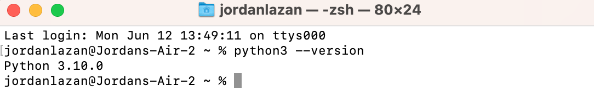

### Set Up a Virtual Environment
Set up a new virtual environment named "cf-python-base" by running the command `mkvirtualenv cf-python-base` in the Terminal.

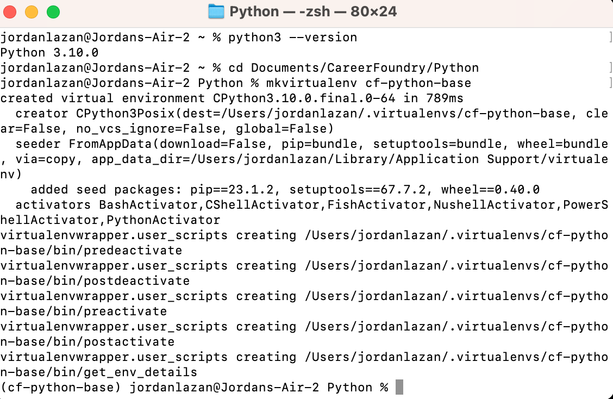

### Create a Python Script
Install Visual Studio Code (or another text editor), and create a Python script "add.py". This script will take two numbers from the user input, add them, and print the result.

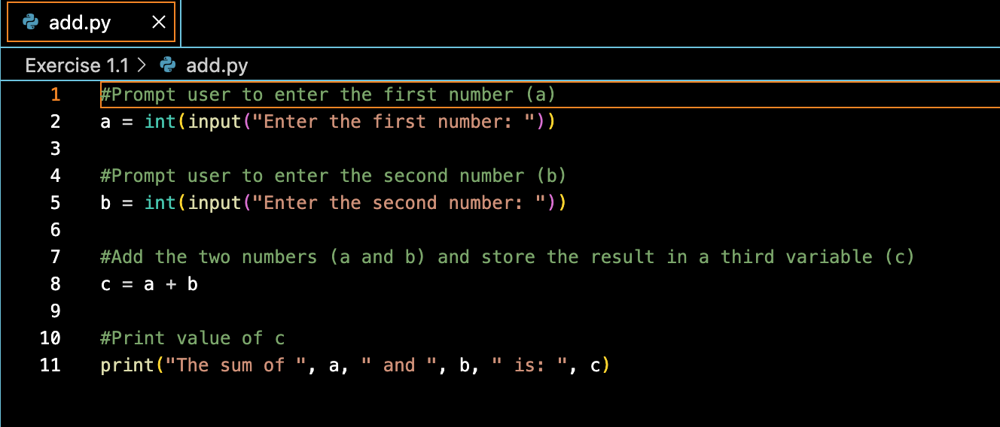
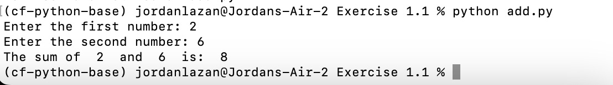

### Set Up IPython Shell
Set up IPython Shell in the virtual environment "cf-python-base". An IPython shell is similar to the regular Python REPL, with additional features like syntax highlighting, auto-indentation, and robust auto-complete features. Install the IPython Shell with the command `pip install ipython` in the Terminal.

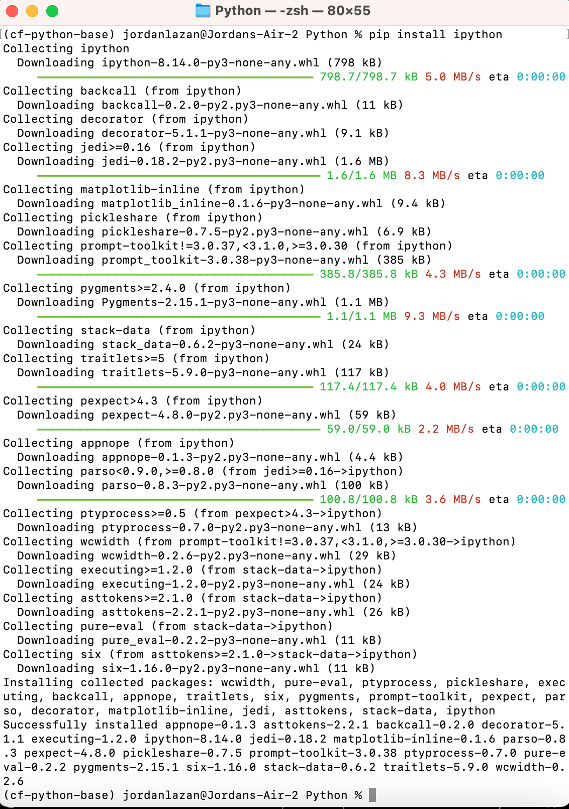

### Export a Requirements File
Generate a “requirements.txt” file from your source environment. To do this, run `pip freeze > requirements.txt` in the Terminal. 
Next, create a new environment called “cf-python-copy” with the `mkvirtualenv cf-python-copy` command. To switch environments, simply use the command `workon <"new environment">`. Once you've moved to the cf-python-copy environment, install packages from the “requirements.txt” file by running the command `pip install -r requirements.txt`.

_pip_freeze_requirements.png)
_new_environment.png)
_pip_install_requirements.png)

### Create a GitHub Repository
Create a new GitHub Repository for the Achievement.

## Exercise 2
1. [Create Data Structure](#create-data-structure)
2. [Create Recipe 1](#create-recipe-1)
3. [Create Recipe List](#create-recipe-list)
4. [Create 4 More Recipes](#create-4-more-recipes)
5. [Print Lists of Ingredients](#print-lists-of-ingredients)

### Create Data Structure
Create a data structure named `recipe_1` that contains the following keys:
- `name` (str): Contains the name of the recipe
- `cooking_time` (int): Contains the cooking time in minutes
- `ingredients` (list): Contains a number of ingredients, each of the str data type

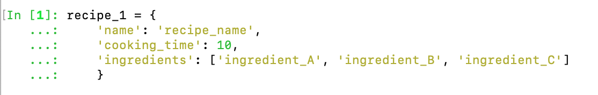

_A dictionary is a suitable data structure for this step. It uses key-value pairs, which works for the name, cooking time, and ingredients keys while allowing different values depending on the specific recipe._

### Create Recipe 1
Make `recipe_1` carry the following attributes:
- Name: Tea
- Cooking time: 5 minutes
- Ingredients: Tea leaves, Sugar, Water

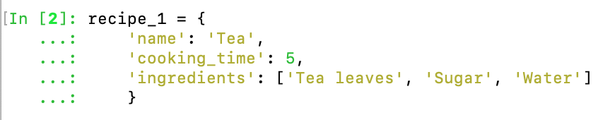

### Create Recipe List
Create an outer structure called `all_recipes`, and then add `recipe_1` to it.

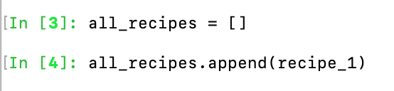

_This outer structure will want to be sequential in nature, where multiple recipes can be stored and modified as required. Therefore, it is best to make it a list._

### Create 4 More Recipes
Create 4 more recipes (`recipe_2`, `recipe_3`, `recipe_4`, and `recipe_5`), an add them to `all_recipes`.

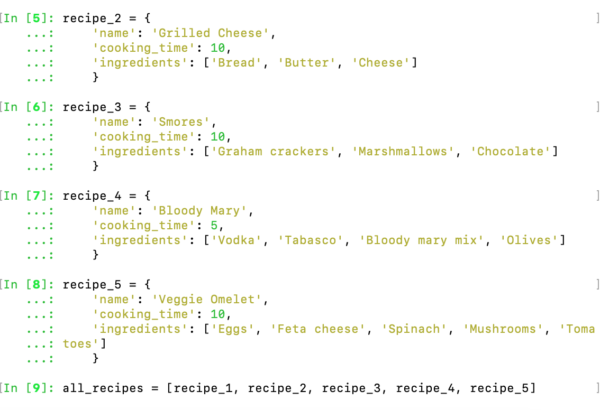

### Print Lists of Ingredients
Print the ingredients of each recipe as five different lists.

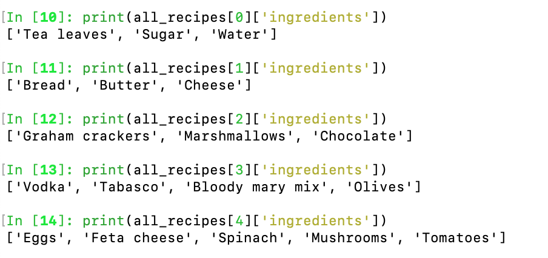

## Exercise 3
1. [Create a New Python Script](#create-a-new-python-script)
2. [Create Empty Lists](#create-empty-lists)
3. [Define take_recipe Function](#define-take-recipe-function)
4. [Ask How Many Recipes](#ask-how-many-recipes)
5. [Check Ingredients For Loop](#check-ingredients-for-loop)
6. [Assign Difficulty Levels For Loop](#assign-difficulty-levels-for-loop)
7. [Display All Ingredients](#display-all-ingredients)

### Create a New Python Script
Open a Python script in an editor of your choice and name it “Exercise_1.3.py”.

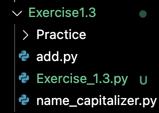

### Create Empty Lists
Initialize two empty lists: `recipes_list` and `ingredients_list`.

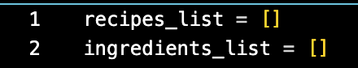

### Define take_recipe Function
Define a function called `take_recipe`, which takes input from the user for the following variables:
- `name` (str): Stores the name of the recipe.
- `cooking_time` (int): Stores the cooking time (in minutes).
- `ingredients` (list): A list that stores ingredients, each of the string data type.
- `recipe` (dictionary): Stores the `name`, `cooking_time`, and `ingredients` variables

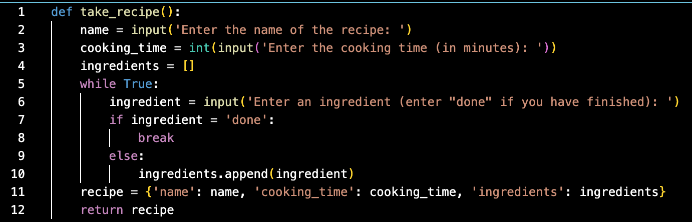

### Ask How Many Recipes
In the main section of your code, ask the user how many recipes they would like to enter. Their response will be linked to a variable `n`.

### Check Ingredients For Loop
Run a `for` loop, which runs `n` times to perform the following steps:
- Run `take_recipe()` and store its return output (a dictionary) in a variable called `recipe`.
- Run another `for` loop inside this loop, which iterates through `recipe`'s `ingredients` list, where it picks out elements one-by-one as `ingredient`. It will run the following step inside: if the chosen `ingredient` isn't present in `ingredients_list`, add it to this list.
- Once you've finished adding ingredients, append `recipe` to `recipes_list`.

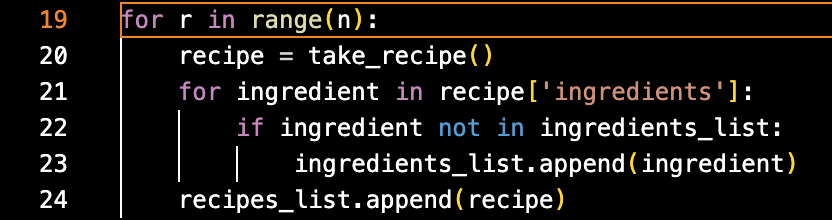

### Assign Difficulty Levels For Loop
Run another `for` loop that iterates through `recipes_list`, picks out each element (a dictionary) as `recipe`, and performs the following steps:
- Determine the `difficulty` of the recipe using the following logic:
  * If  `cooking_time` is less than 10 minutes, and the number of `ingredients` is less than 4, set a variable called `difficulty` to the value of `Easy`.
  * If  `cooking_time` is less than 10 minutes, and the number of `ingredients` is greater than or equal to 4, set a variable called `difficulty` to the value of `Medium`.
  * If  `cooking_time` is greater than or equal to 10 minutes, and the number of `ingredients` is less than 4, set a variable called `difficulty` to the value of `Intermediate`.
  * If  `cooking_time` is greater than or equal to 10 minutes, and the number of `ingredients` is greater than or equal to 4, set a variable called `difficulty` to the value of `Hard`.
- Display the recipe in the following format, using values from each dictionary (`recipe`) obtained from `recipes_list`:
  `Recipe: Instant Noodles
  Cooking Time (min): 5
  Ingredients:
  Noodle Cakes
  Flavoring
  Water
  Difficulty level: Easy`

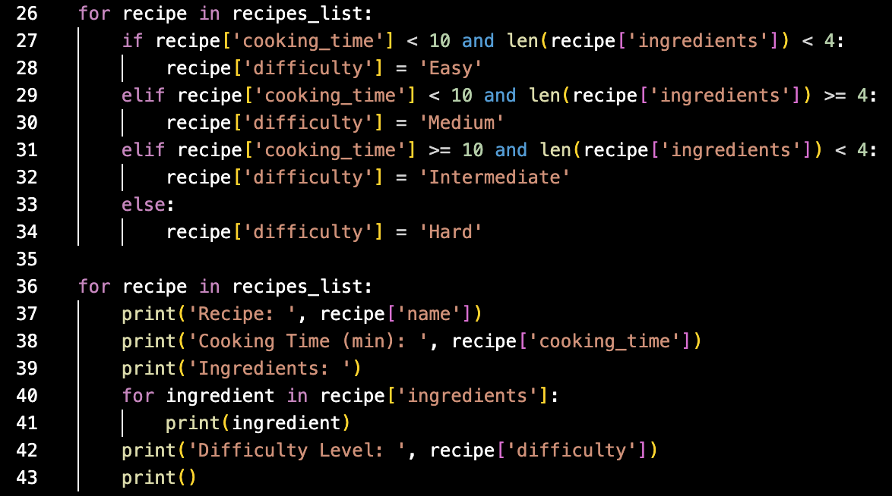

### Display All Ingredients
Next, you’ll have to display all the ingredients that you’ve come across so far in all of the recipes that you’ve just entered. In Step 5 you appended these ingredients into `ingredient_list`. Now it’s time to print them all out. Print them in alphabetical order.

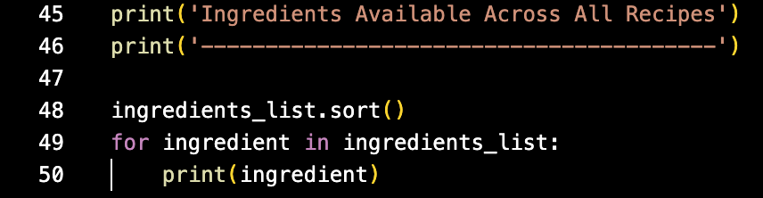

