# Python For Web Developers

## Exercises
1. [Exercise 1](#exercise-1)
2. [Exercise 2](#exercise-2)
3. [Exercise 3](#exercise-3)
4. [Exercise 4](#exercise-4)
5. [Exercise 5](#exercise-5)
6. [Exercise 6](#exercise-6)

## Exercise 1
1. [Install Python](#install-python)
2. [Set Up a Virtual Environment](#set-up-a-virtual-environment)
3. [Create a Python Script](#create-a-python-script)
5. [Set Up IPython Shell](#set-up-ipython-shell)
7. [Export a Requirements File](#export-a-requirements-file)
8. [Create a GitHub Repository](#create-a-github-repository)

### Install Python
First, install Python on your system. Check your Python version by running the command `python3 --version` in the Terminal.

### Set Up a Virtual Environment
Set up a new virtual environment named "cf-python-base" by running the command `mkvirtualenv cf-python-base` in the Terminal.

### Create a Python Script
Install Visual Studio Code (or another text editor), and create a Python script "add.py". This script will take two numbers from the user input, add them, and print the result.

### Set Up IPython Shell
Set up IPython Shell in the virtual environment "cf-python-base". An IPython shell is similar to the regular Python REPL, with additional features like syntax highlighting, auto-indentation, and robust auto-complete features. Install the IPython Shell with the command `pip install ipython` in the Terminal.

### Export a Requirements File
Generate a “requirements.txt” file from your source environment. To do this, run `pip freeze > requirements.txt` in the Terminal. 
Next, create a new environment called “cf-python-copy” with the `mkvirtualenv cf-python-copy` command. To switch environments, simply use the command `workon <"new environment">`. Once you've moved to the cf-python-copy environment, install packages from the “requirements.txt” file by running the command `pip install -r requirements.txt`.

_pip_freeze_requirements.png)
_new_environment.png)
_pip_install_requirements.png)

### Create a GitHub Repository
Create a new GitHub Repository for the Achievement.

## Exercise 2
1. [Create Data Structure](#create-data-structure)
2. [Create Recipe 1](#create-recipe-1)
3. [Create Recipe List](#create-recipe-list)
4. [Create 4 More Recipes](#create-4-more-recipes)
5. [Print Lists of Ingredients](#print-lists-of-ingredients)

### Create Data Structure
Create a data structure named `recipe_1` that contains the following keys:
- `name` (str): Contains the name of the recipe
- `cooking_time` (int): Contains the cooking time in minutes
- `ingredients` (list): Contains a number of ingredients, each of the str data type

_A dictionary is a suitable data structure for this step. It uses key-value pairs, which works for the name, cooking time, and ingredients keys while allowing different values depending on the specific recipe._

### Create Recipe 1
Make `recipe_1` carry the following attributes:
- Name: Tea
- Cooking time: 5 minutes
- Ingredients: Tea leaves, Sugar, Water

### Create Recipe List
Create an outer structure called `all_recipes`, and then add `recipe_1` to it.

_This outer structure will want to be sequential in nature, where multiple recipes can be stored and modified as required. Therefore, it is best to make it a list._

### Create 4 More Recipes
Create 4 more recipes (`recipe_2`, `recipe_3`, `recipe_4`, and `recipe_5`), an add them to `all_recipes`.

### Print Lists of Ingredients
Print the ingredients of each recipe as five different lists.

## Exercise 3
1. [Create a New Python Script](#create-a-new-python-script)
2. [Create Empty Lists](#create-empty-lists)
3. [Define Recipe Function](#define-recipe-function)
4. [Ask How Many Recipes](#ask-how-many-recipes)
5. [Check Ingredients For Loop](#check-ingredients-for-loop)
6. [Assign Difficulty Levels For Loop](#assign-difficulty-levels-for-loop)
7. [Display All Ingredients](#display-all-ingredients)

### Create a New Python Script
Open a Python script in an editor of your choice and name it “Exercise_1.3.py”.

### Create Empty Lists
Initialize two empty lists: `recipes_list` and `ingredients_list`.

### Define Recipe Function
Define a function called `take_recipe`, which takes input from the user for the following variables:
- `name` (str): Stores the name of the recipe.
- `cooking_time` (int): Stores the cooking time (in minutes).
- `ingredients` (list): A list that stores ingredients, each of the string data type.
- `recipe` (dictionary): Stores the `name`, `cooking_time`, and `ingredients` variables

### Ask How Many Recipes
In the main section of your code, ask the user how many recipes they would like to enter. Their response will be linked to a variable `n`.

### Check Ingredients For Loop
Run a `for` loop, which runs `n` times to perform the following steps:
- Run `take_recipe()` and store its return output (a dictionary) in a variable called `recipe`.
- Run another `for` loop inside this loop, which iterates through `recipe`'s `ingredients` list, where it picks out elements one-by-one as `ingredient`. It will run the following step inside: if the chosen `ingredient` isn't present in `ingredients_list`, add it to this list.
- Once you've finished adding ingredients, append `recipe` to `recipes_list`.

### Assign Difficulty Levels For Loop
Run another `for` loop that iterates through `recipes_list`, picks out each element (a dictionary) as `recipe`, and performs the following steps:
- Determine the `difficulty` of the recipe using the following logic:
  * If  `cooking_time` is less than 10 minutes, and the number of `ingredients` is less than 4, set a variable called `difficulty` to the value of `Easy`.
  * If  `cooking_time` is less than 10 minutes, and the number of `ingredients` is greater than or equal to 4, set a variable called `difficulty` to the value of `Medium`.
  * If  `cooking_time` is greater than or equal to 10 minutes, and the number of `ingredients` is less than 4, set a variable called `difficulty` to the value of `Intermediate`.
  * If  `cooking_time` is greater than or equal to 10 minutes, and the number of `ingredients` is greater than or equal to 4, set a variable called `difficulty` to the value of `Hard`.
- Display the recipe in the following format, using values from each dictionary (`recipe`) obtained from `recipes_list`:
  * Recipe:
  * Cooking Time (min):
  * Ingredients:
  * Difficulty level:

### Display All Ingredients
Next, you’ll have to display all the ingredients that you’ve come across so far in all of the recipes that you’ve just entered. In Step 5 you appended these ingredients into `ingredient_list`. Now it’s time to print them all out. Print them in alphabetical order.

## Exercise 4
1. [Part 1](#exercise-4-part-1)
2. [Part 2](#exercise-4-part-2)
3. [Part 3](#exercise-4-part-3)

### Exercise 4 Part 1
1. [Import Pickle Module](#import-pickle-module)
2. [Define the Take Recipe Function](#define-the-take-recipe-function)
3. [Define the Calc Difficulty Function](#define-the-calc-difficulty-function)
4. [Try Except Else Finally Block](#try-except-else-finally-block)
5. [Take New Recipes from User](#take-new-recipes-from-user)
6. [Create Data Dictionary](#create-data-dictionary)
7. [Save Data to a Binary File](#save-data-to-a-binary-file)

#### Import Pickle Module
Import the `pickle` module so you can work with binary files

#### Define the Take Recipe Function
Define a function called `take_recipe()` to take recipes from the user, which performs the following operations:
- Taking in the recipe name, cooking time, and ingredients from the user.
- Calculating the difficulty of the recipe by calling the `calc_difficulty()` function.
- Gathering all these attributes into a dictionary and returning it.

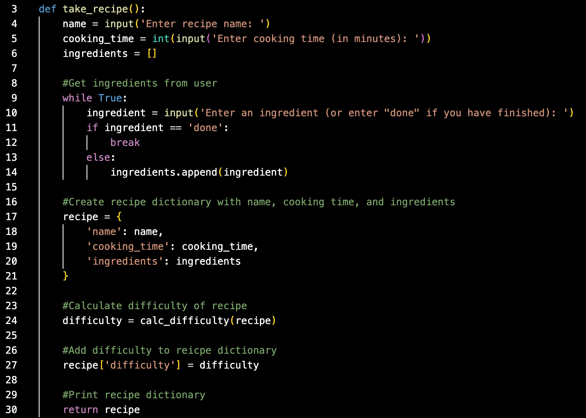

#### Define the Calc Difficulty Function
Define the function `calc_difficulty()`, where the difficulty is returned as `Easy`, `Medium`, `Intermediate`, or `Hard`, based on the following logic:
- If `cooking_time` is less than 10 minutes and the number of ingredients is less than 4, set a variable called `difficulty` to the value of `Easy`.
- If `cooking_time` is less than 10 minutes and the number of ingredients is greater than or equal to 4, set a variable called `difficulty` to the value of `Medium`.
- If `cooking_time` is greater than or equal to 10 minutes and the number of ingredients is less than 4, set a variable called `difficulty` to the value of `Intermediate`.
- If `cooking_time` is greater than or equal to 10 minutes and the number of ingredients is greater than or equal to 4, set a variable called `difficulty` to the value of `Hard`.

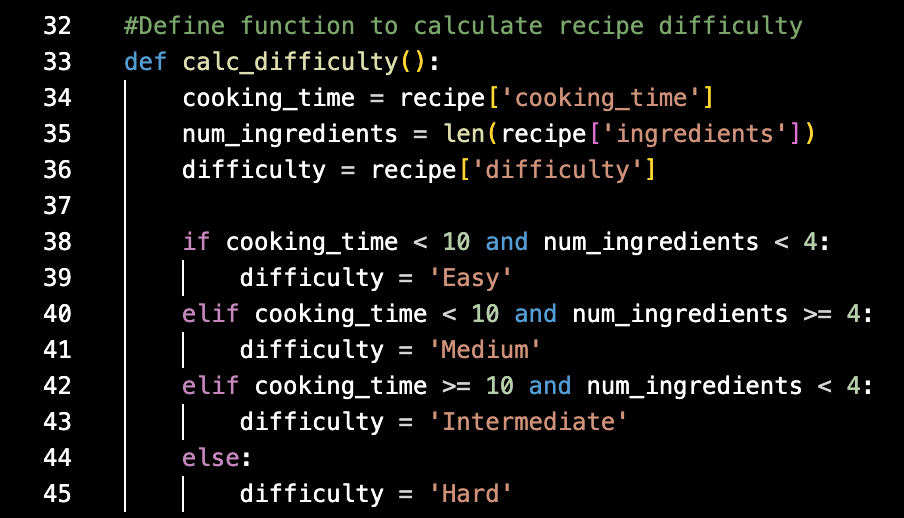

#### Try Except Else Finally Block
Next, you’ll work on the main code. Have the user enter a filename, which would attempt to open a binary file in read mode. Define a `try-except-else-finally` block as follows:
- The `try` block will open the given file, and load its contents through the `pickle` module into a variable called `data`. The incoming data is expected to be a dictionary containing two key-value pairs:
  - `recipes_list` (a list of all recipes)
  - `all_ingredients` (a list of all ingredients across all recipes)
- An `except` clause handles the `FileNotFoundError` exception if a file with the given name isn’t found. The code block after will create a new dictionary called `data`, which contains the recipes list under the key `recipes_list` and another list containing all the ingredients under `all_ingredients`.
- Another `except` clause that handles other exceptions and performs the same operations as the first `except` block.
An `else` block that closes the file stream that would’ve been opened in the `try` block.
A `finally` block that extracts the values from the dictionary into two separate lists: `recipes_list` and `all_ingredients`.

#### Take New Recipes from User
Ask the user how many recipes they’d like to enter, and define a `for` loop that calls the `take_recipe()` function. You can append the output of this function into `recipes_list`. Next, define an inner loop that scans through the recipe’s ingredients and adds them to `all_ingredients` if they’re not already there.

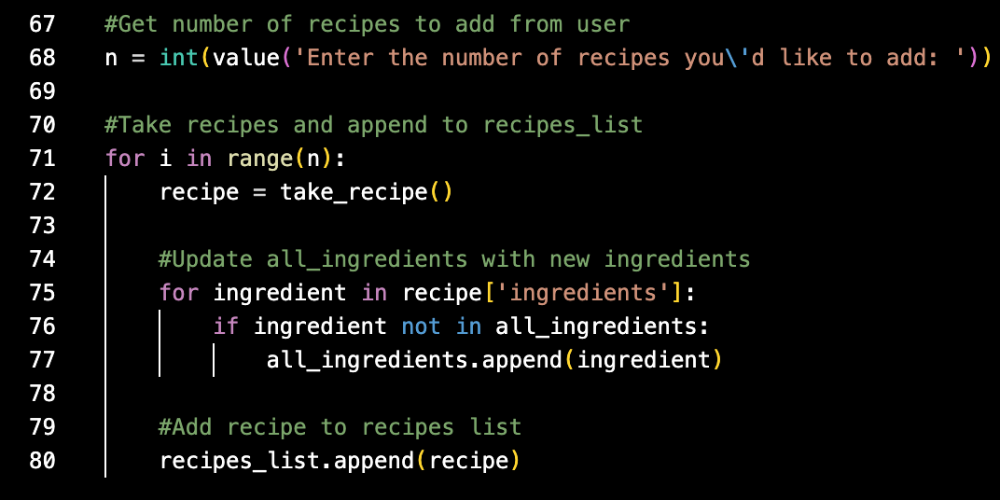

#### Create Data Dictionary
Gather the updated `recipes_list` and `all_ingredients` into the dictionary called `data`.

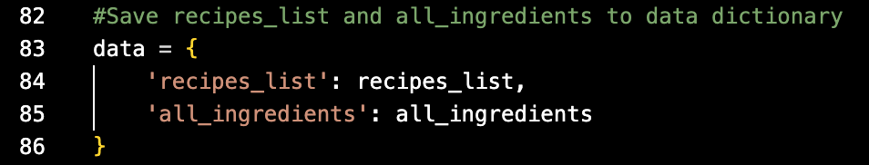

#### Save Data to a Binary File
Finally, open a binary file with the user-defined filename and write `data` to it using the `pickle` module.

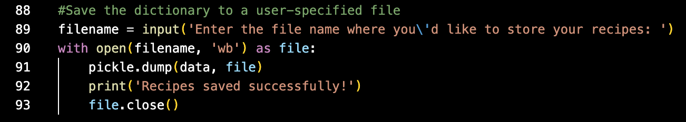

### Exercise 4 Part 2
1. [Import Pickle Module](#import-pickle-module)
2. [Define Display Recipe Function](#define-display-recipe-function)
3. [Define Search Ingredient Function](#define-search-ingredient-function)
4. [Ask User for Recipe File](#ask-user-for-recipe-file)
5. [Try Block](#try-block)
6. [Except Block](#except-block)
7. [Else Block](#else-block)

#### Import Pickle Module
Import the `pickle` module.

#### Define Display Recipe Function
Define a function to display a recipe called `display_recipe()`, which takes in one recipe (of the dictionary type) as an argument and prints all of its attributes including the recipe name, cooking time, ingredients, and difficulty.

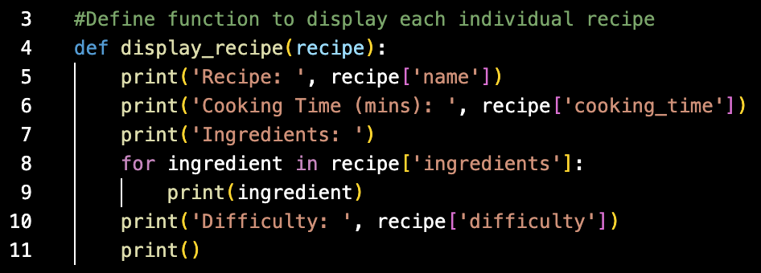

#### Define Search Ingredient Function
Define another function called `search_ingredient()` to search for an ingredient in the given data. The function takes in a dictionary called `data` as its argument. The function will perform the following steps:
- First, it shows the user all the available ingredients contained in `data`, under the key `all_ingredients`. Each ingredient is displayed with a number (take the index of each ingredient for this purpose using the `enumerate()` function).
Define a `try` block where the user gets to pick a number from this list. This number is used as the index to retrieve the corresponding ingredient, which is then stored into a variable called `ingredient_searched`.
Make an except clause that warns the user if the input is incorrect.
Add an else clause that goes through every recipe in `data` (hint: `recipes_list` is the key that holds every recipe). Each recipe that contains the given ingredient will be printed.

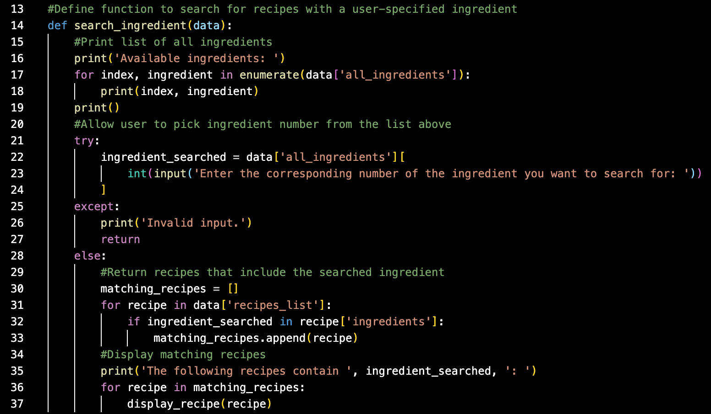

#### Ask User for Recipe File
In the main code, ask the user for the name of the file that contains your recipe data.

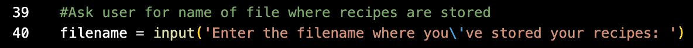

#### Try Block
Use a `try` block to open the file, and then extract its contents into `data` (from Step 3) using the `pickle` module.

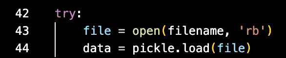

#### Except Block
For when the `try` block fails, add an `except` block to warn the user that the file hasn’t been found.

#### Else block
Define an `else` block that calls `search_ingredient()` while passing `data` into it as an argument.

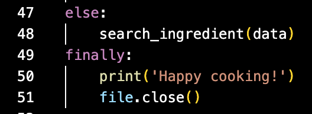

### Exercise 4 Part 3
1. [Run Recipe Input File](#run-recipe-input-file)
2. [Run Recipe Search File](#run-recipe-search-file)

#### Run Recipe Input File
Run “recipe_input.py” and enter a few sample recipes of your choice. Make sure the script can generate a binary file after execution. Take screenshots of your terminal while executing the script.

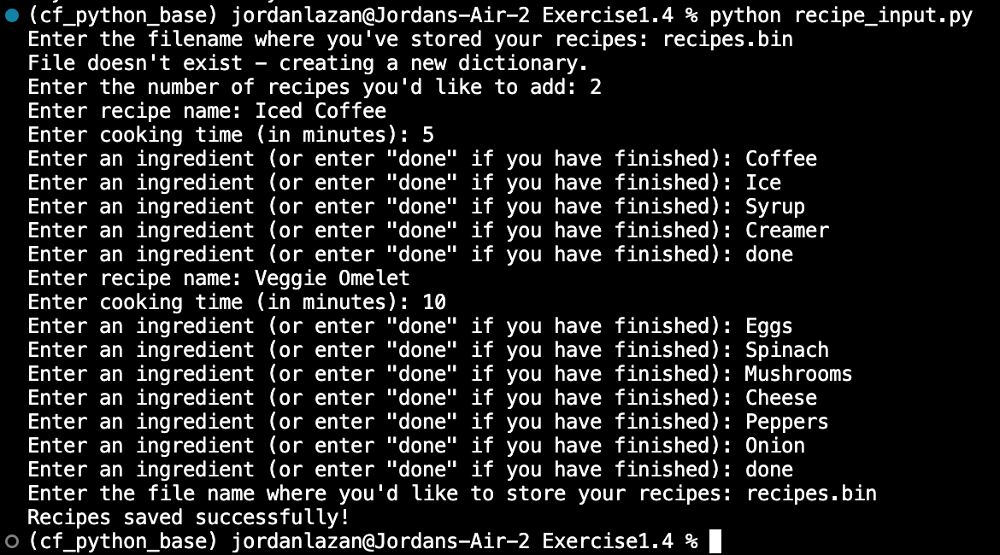

#### Run Recipe Search File
Run “recipe_search.py”, enter the ingredient to be searched for, and make sure you get the desired output with the relevant recipes. Take more screenshots of the script while executing.

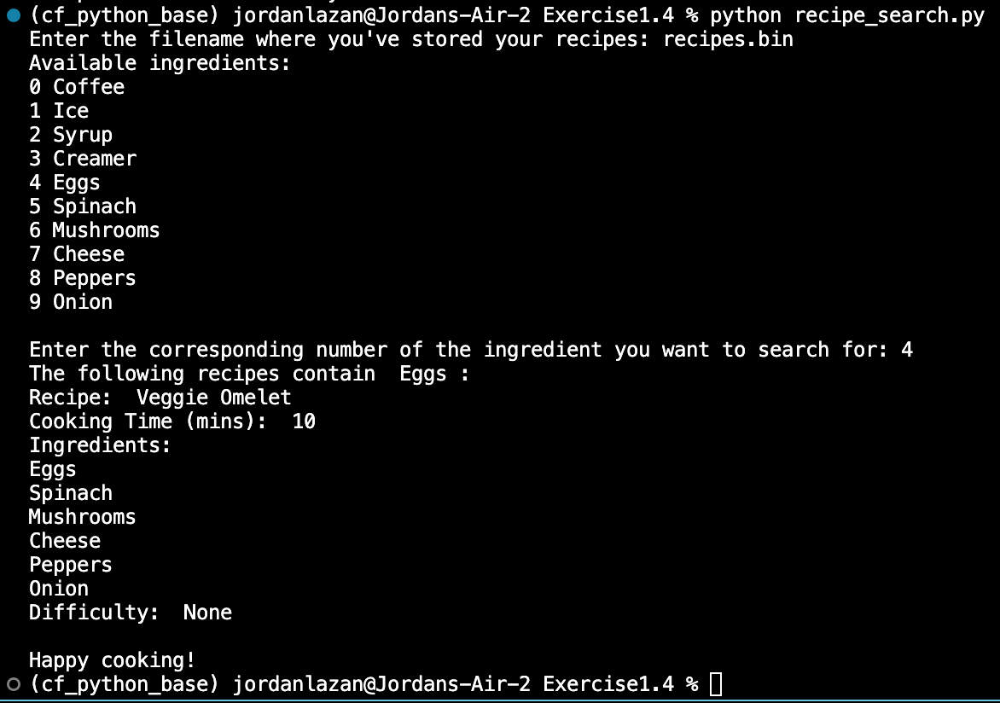

## Exercise 5
1. [Define Recipe Class](#define-recipe-class)
2. [Define Class Attributes and Methods](#define-class-attributes-and-methods)
3. [Define Recipe Search Method](#define-recipe-search-method)
4. [Make First Recipe Object](#make-first-recipe-object)
5. [Make More Recipe Objects](#make-more-recipe-objects)
6. [Wrap Recipes in a List](#wrap-recipes-in-a-list)
7. [Use Recipe Search Method](#use-recipe-search-method)
8. [Run the Script](#run-the-script)

### Define Recipe Class
Define a class `Recipe`, with the following data attributes:
- `name`: the name of a recipe
- `ingredients`: a list containing the ingredients for a recipe
- `cooking_time`: the time taken in minutes to carry out a recipe
- `difficulty`: an auto-generated attribute that says whether the recipe is `Easy`, `Medium`, `Intermediate`, or `Hard` based on the following logic (this attribute will be updated by the upcoming `calculate_difficulty()` class method):
  * If `cooking_time` is less than 10 minutes, and the number of `ingredients` is less than 4, set a variable called difficulty to the value of `Easy`.
  * If `cooking_time` is less than 10 minutes, and the number of `ingredients` is greater than or equal to 4, set a variable called `difficulty` to the value of `Medium`.
  * If `cooking_time` is greater than or equal to 10 minutes, and the number of `ingredients` is less than 4, set a variable called `difficulty` to the value of `Intermediate`.
  * If `cooking_time` is greater than or equal to 10 minutes, and the number of `ingredients` is greater than or equal to 4, set a variable called `difficulty` to the value of `Hard`.

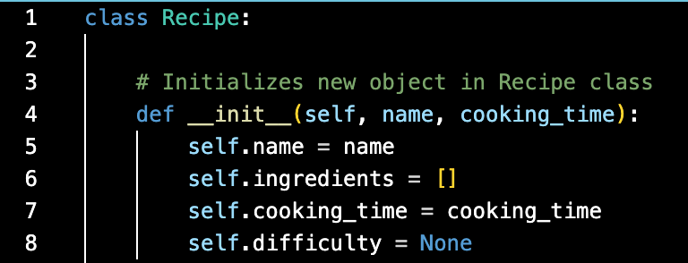

### Define Class Attributes and Methods
Define the following procedural attributes (methods) for the class as well:
- An initialization method that takes in the `name` for the recipe and initializes the other data attributes too. Getter and setter methods for `name` and `cooking_time`.
- A method called `add_ingredients` that takes in variable-length arguments for the recipe’s ingredients. For example, the arguments could be either `("Salt")` or even `("Salt", "Pepper", "Flour", "Water", "Bananas", "Marzipan")`; your method should take in these ingredients and add them to `ingredients`. Once all the ingredients are added, this function calls `update_all_ingredients()` , which you’ll define shortly.
- A getter method for `ingredients` that returns the list itself.
- A method called `calculate_difficulty()` that uses the logic in part 1 of this task, and updates the difficulty of the recipe.
- A getter method for `difficulty` which also calls `calculate_difficulty()` if `difficulty` hasn’t been calculated.
- A search method called `search_ingredient()` that takes an ingredient as an argument, searches for it in the recipe, and returns `True` or `False` appropriately.
- A method called `update_all_ingredients()` that goes through the current object’s ingredients and adds them to a class variable called `all_ingredients`, if they’re not already present. This class variable keeps track of all the ingredients that exist across all recipes.
- A string representation that prints the entire recipe over a well formatted string.

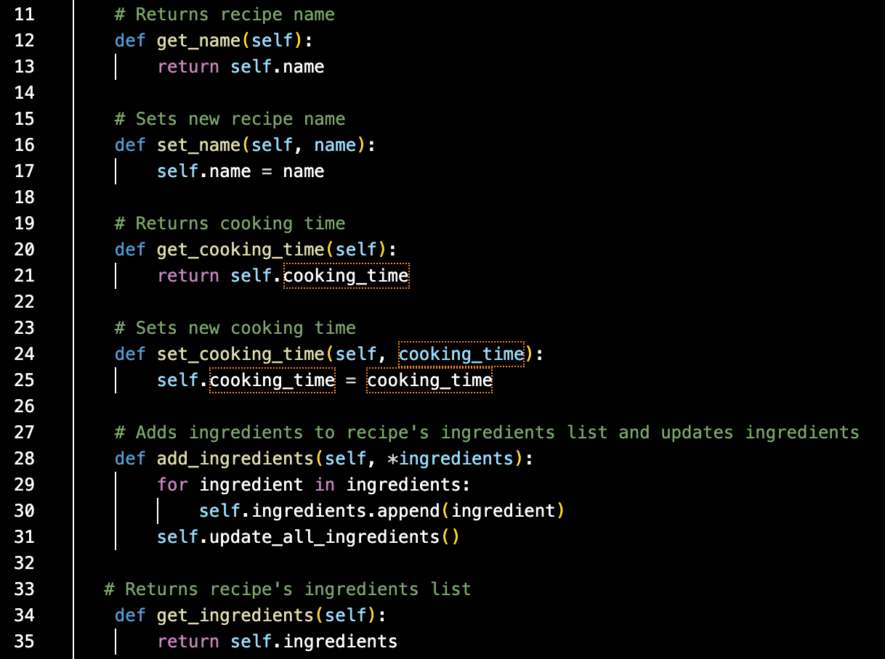
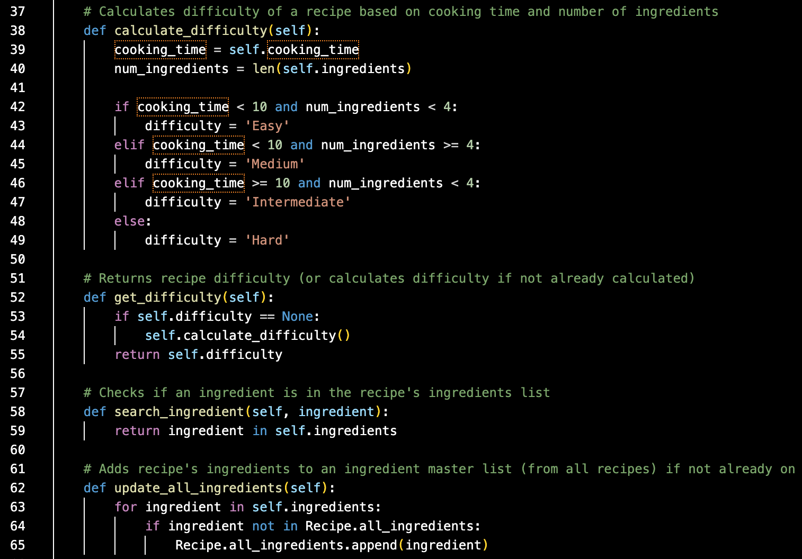
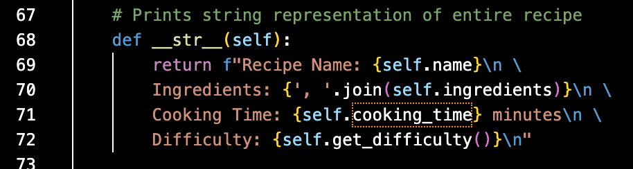

### Define Recipe Search Method
To find recipes that contain a specific ingredient, define a method called `recipe_search()`:
- Define 2 parameters for this method:
  * `data`: takes in a list of `Recipe` objects to search from
  * `search_term`: the ingredient to be searched for
- Run a `for` loop that traverses through `data`, and performs the following steps:
  * Within the object that is in focus, call the `search_ingredient` method to see if the ingredient is present or not.
  * If the above condition is satisfied, print the recipe.

 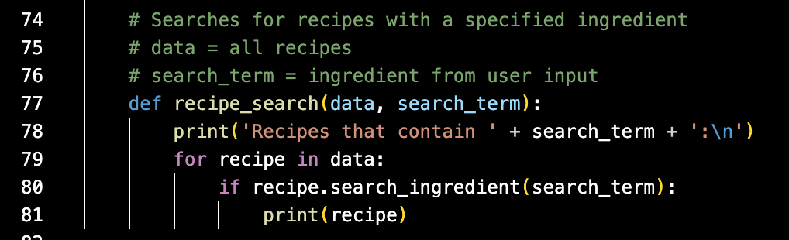
 
### Make First Recipe Object
In the main code, make an object under the `Recipe` class:
- Initialize an object named `tea` under this class, and set the recipe’s name as `"Tea"` through the initialization step.
- Add the following ingredients to this recipe: `Tea Leaves`, `Sugar`, `Water`.
- Set the cooking time for this recipe as `5` (in minutes).
- Display the string representation of this object.

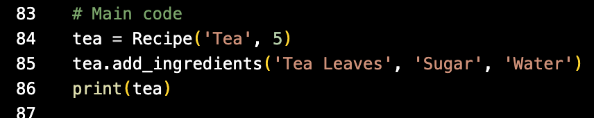

### Make More Recipe Objects
Make a few more recipes with the given attributes, and display their respective string representations as well:
- `Coffee`:
  * `Ingredients`: Coffee Powder, Sugar, Water
  * `Cooking time`: 5 minutes
- `Cake`:
  * `Ingredients`: Sugar, Butter, Eggs, Vanilla Essence, Flour, Baking Powder, Milk
  * `Cooking time`: 50 minutes
- `Banana Smoothie`:
  * `Ingredients`: Bananas, Milk, Peanut Butter, Sugar, Ice Cubes
  * `Cooking time`: 5 minutes

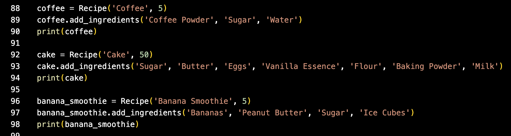

### Wrap Recipes in a List
Wrap the recipes into a list called `recipes_list`.

### Use Recipe Search Method
Use the `recipe_search()` method to search for recipes that contain each ingredient out of: `Water`, `Sugar`, `Bananas`.

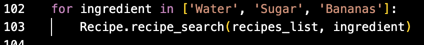

### Run the Script

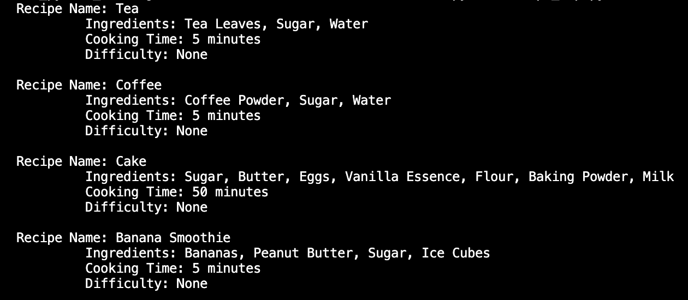
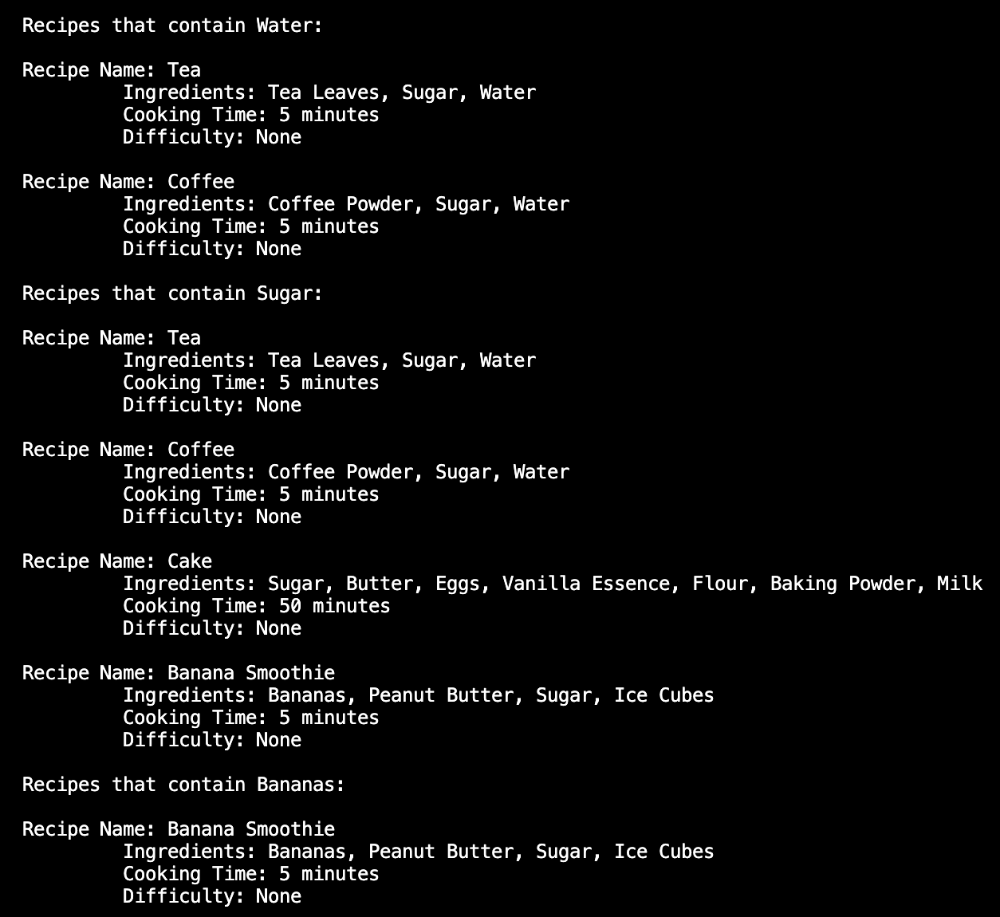

## Exercise 6
1. [Create & Connect Database](#create-&-connect-database)
2. [The Main Menu](#the-main-menu)
3. [Creating a Recipe with create_recipe()](#creating-a-recipe-with-create_recipe())

3. Creating a Recipe with create_recipe()

