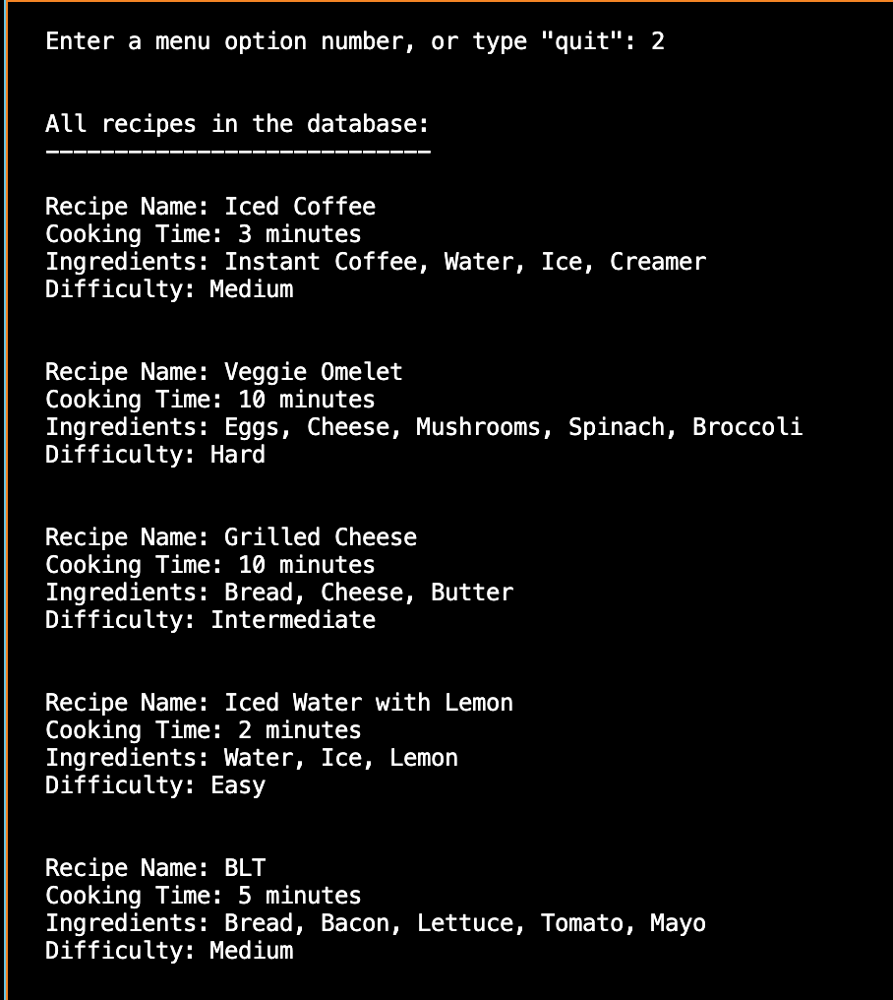
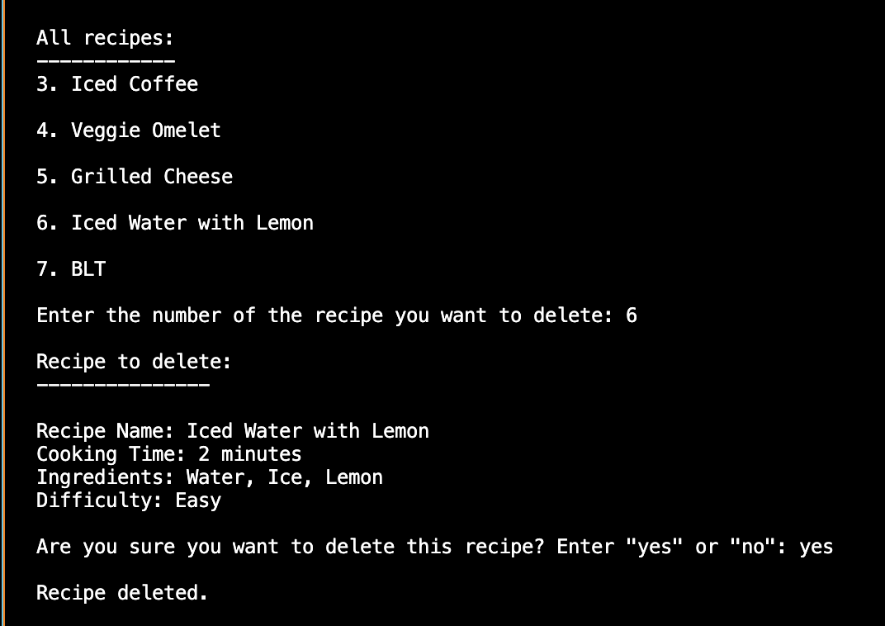

# Python For Web Developers

## Exercises
1. [Exercise 1](#exercise-1)
2. [Exercise 2](#exercise-2)
3. [Exercise 3](#exercise-3)
4. [Exercise 4](#exercise-4)
5. [Exercise 5](#exercise-5)
6. [Exercise 6](#exercise-6)
7. [Exercise 7](#exercise-7)

## Exercise 1
1. [Install Python](#install-python)
2. [Set Up a Virtual Environment](#set-up-a-virtual-environment)
3. [Create a Python Script](#create-a-python-script)
5. [Set Up IPython Shell](#set-up-ipython-shell)
7. [Export a Requirements File](#export-a-requirements-file)
8. [Create a GitHub Repository](#create-a-github-repository)

### Install Python
First, install Python on your system. Check your Python version by running the command `python3 --version` in the Terminal.

### Set Up a Virtual Environment
Set up a new virtual environment named "cf-python-base" by running the command `mkvirtualenv cf-python-base` in the Terminal.

### Create a Python Script
Install Visual Studio Code (or another text editor), and create a Python script "add.py". This script will take two numbers from the user input, add them, and print the result.

### Set Up IPython Shell
Set up IPython Shell in the virtual environment "cf-python-base". An IPython shell is similar to the regular Python REPL, with additional features like syntax highlighting, auto-indentation, and robust auto-complete features. Install the IPython Shell with the command `pip install ipython` in the Terminal.

### Export a Requirements File
Generate a “requirements.txt” file from your source environment. To do this, run `pip freeze > requirements.txt` in the Terminal. 
Next, create a new environment called “cf-python-copy” with the `mkvirtualenv cf-python-copy` command. To switch environments, simply use the command `workon <"new environment">`. Once you've moved to the cf-python-copy environment, install packages from the “requirements.txt” file by running the command `pip install -r requirements.txt`.

_pip_freeze_requirements.png)
_new_environment.png)
_pip_install_requirements.png)

### Create a GitHub Repository
Create a new GitHub Repository for the Achievement.

## Exercise 2
1. [Create Data Structure](#create-data-structure)
2. [Create Recipe 1](#create-recipe-1)
3. [Create Recipe List](#create-recipe-list)
4. [Create 4 More Recipes](#create-4-more-recipes)
5. [Print Lists of Ingredients](#print-lists-of-ingredients)

### Create Data Structure
Create a data structure named `recipe_1` that contains the following keys:
- `name` (str): Contains the name of the recipe
- `cooking_time` (int): Contains the cooking time in minutes
- `ingredients` (list): Contains a number of ingredients, each of the str data type

_A dictionary is a suitable data structure for this step. It uses key-value pairs, which works for the name, cooking time, and ingredients keys while allowing different values depending on the specific recipe._

### Create Recipe 1
Make `recipe_1` carry the following attributes:
- Name: Tea
- Cooking time: 5 minutes
- Ingredients: Tea leaves, Sugar, Water

### Create Recipe List
Create an outer structure called `all_recipes`, and then add `recipe_1` to it.

_This outer structure will want to be sequential in nature, where multiple recipes can be stored and modified as required. Therefore, it is best to make it a list._

### Create 4 More Recipes
Create 4 more recipes (`recipe_2`, `recipe_3`, `recipe_4`, and `recipe_5`), an add them to `all_recipes`.

### Print Lists of Ingredients
Print the ingredients of each recipe as five different lists.

## Exercise 3
1. [Create a New Python Script](#create-a-new-python-script)
2. [Create Empty Lists](#create-empty-lists)
3. [Define Recipe Function](#define-recipe-function)
4. [Ask How Many Recipes](#ask-how-many-recipes)
5. [Check Ingredients For Loop](#check-ingredients-for-loop)
6. [Assign Difficulty Levels For Loop](#assign-difficulty-levels-for-loop)
7. [Display All Ingredients](#display-all-ingredients)

### Create a New Python Script
Open a Python script in an editor of your choice and name it “Exercise_1.3.py”.

### Create Empty Lists
Initialize two empty lists: `recipes_list` and `ingredients_list`.

### Define Recipe Function
Define a function called `take_recipe`, which takes input from the user for the following variables:
- `name` (str): Stores the name of the recipe.
- `cooking_time` (int): Stores the cooking time (in minutes).
- `ingredients` (list): A list that stores ingredients, each of the string data type.
- `recipe` (dictionary): Stores the `name`, `cooking_time`, and `ingredients` variables

### Ask How Many Recipes
In the main section of your code, ask the user how many recipes they would like to enter. Their response will be linked to a variable `n`.

### Check Ingredients For Loop
Run a `for` loop, which runs `n` times to perform the following steps:
- Run `take_recipe()` and store its return output (a dictionary) in a variable called `recipe`.
- Run another `for` loop inside this loop, which iterates through `recipe`'s `ingredients` list, where it picks out elements one-by-one as `ingredient`. It will run the following step inside: if the chosen `ingredient` isn't present in `ingredients_list`, add it to this list.
- Once you've finished adding ingredients, append `recipe` to `recipes_list`.

### Assign Difficulty Levels For Loop
Run another `for` loop that iterates through `recipes_list`, picks out each element (a dictionary) as `recipe`, and performs the following steps:
- Determine the `difficulty` of the recipe using the following logic:
  * If  `cooking_time` is less than 10 minutes, and the number of `ingredients` is less than 4, set a variable called `difficulty` to the value of `Easy`.
  * If  `cooking_time` is less than 10 minutes, and the number of `ingredients` is greater than or equal to 4, set a variable called `difficulty` to the value of `Medium`.
  * If  `cooking_time` is greater than or equal to 10 minutes, and the number of `ingredients` is less than 4, set a variable called `difficulty` to the value of `Intermediate`.
  * If  `cooking_time` is greater than or equal to 10 minutes, and the number of `ingredients` is greater than or equal to 4, set a variable called `difficulty` to the value of `Hard`.
- Display the recipe in the following format, using values from each dictionary (`recipe`) obtained from `recipes_list`:
  * Recipe:
  * Cooking Time (min):
  * Ingredients:
  * Difficulty level:

### Display All Ingredients
Next, you’ll have to display all the ingredients that you’ve come across so far in all of the recipes that you’ve just entered. In Step 5 you appended these ingredients into `ingredient_list`. Now it’s time to print them all out. Print them in alphabetical order.

## Exercise 4
1. [Part 1](#exercise-4-part-1)
2. [Part 2](#exercise-4-part-2)
3. [Part 3](#exercise-4-part-3)

### Exercise 4 Part 1
1. [Import Pickle Module](#import-pickle-module)
2. [Define the Take Recipe Function](#define-the-take-recipe-function)
3. [Define the Calc Difficulty Function](#define-the-calc-difficulty-function)
4. [Try Except Else Finally Block](#try-except-else-finally-block)
5. [Take New Recipes from User](#take-new-recipes-from-user)
6. [Create Data Dictionary](#create-data-dictionary)
7. [Save Data to a Binary File](#save-data-to-a-binary-file)

#### Import Pickle Module
Import the `pickle` module so you can work with binary files

#### Define the Take Recipe Function
Define a function called `take_recipe()` to take recipes from the user, which performs the following operations:
- Taking in the recipe name, cooking time, and ingredients from the user.
- Calculating the difficulty of the recipe by calling the `calc_difficulty()` function.
- Gathering all these attributes into a dictionary and returning it.

#### Define the Calc Difficulty Function
Define the function `calc_difficulty()`, where the difficulty is returned as `Easy`, `Medium`, `Intermediate`, or `Hard`, based on the following logic:
- If `cooking_time` is less than 10 minutes and the number of ingredients is less than 4, set a variable called `difficulty` to the value of `Easy`.
- If `cooking_time` is less than 10 minutes and the number of ingredients is greater than or equal to 4, set a variable called `difficulty` to the value of `Medium`.
- If `cooking_time` is greater than or equal to 10 minutes and the number of ingredients is less than 4, set a variable called `difficulty` to the value of `Intermediate`.
- If `cooking_time` is greater than or equal to 10 minutes and the number of ingredients is greater than or equal to 4, set a variable called `difficulty` to the value of `Hard`.

#### Try Except Else Finally Block
Next, you’ll work on the main code. Have the user enter a filename, which would attempt to open a binary file in read mode. Define a `try-except-else-finally` block as follows:
- The `try` block will open the given file, and load its contents through the `pickle` module into a variable called `data`. The incoming data is expected to be a dictionary containing two key-value pairs:
  - `recipes_list` (a list of all recipes)
  - `all_ingredients` (a list of all ingredients across all recipes)
- An `except` clause handles the `FileNotFoundError` exception if a file with the given name isn’t found. The code block after will create a new dictionary called `data`, which contains the recipes list under the key `recipes_list` and another list containing all the ingredients under `all_ingredients`.
- Another `except` clause that handles other exceptions and performs the same operations as the first `except` block.
An `else` block that closes the file stream that would’ve been opened in the `try` block.
A `finally` block that extracts the values from the dictionary into two separate lists: `recipes_list` and `all_ingredients`.

#### Take New Recipes from User
Ask the user how many recipes they’d like to enter, and define a `for` loop that calls the `take_recipe()` function. You can append the output of this function into `recipes_list`. Next, define an inner loop that scans through the recipe’s ingredients and adds them to `all_ingredients` if they’re not already there.

#### Create Data Dictionary
Gather the updated `recipes_list` and `all_ingredients` into the dictionary called `data`.

#### Save Data to a Binary File
Finally, open a binary file with the user-defined filename and write `data` to it using the `pickle` module.

### Exercise 4 Part 2
1. [Import Pickle Module](#import-pickle-module)
2. [Define Display Recipe Function](#define-display-recipe-function)
3. [Define Search Ingredient Function](#define-search-ingredient-function)
4. [Ask User for Recipe File](#ask-user-for-recipe-file)
5. [Try Block](#try-block)
6. [Except Block](#except-block)
7. [Else Block](#else-block)

#### Import Pickle Module
Import the `pickle` module.

#### Define Display Recipe Function
Define a function to display a recipe called `display_recipe()`, which takes in one recipe (of the dictionary type) as an argument and prints all of its attributes including the recipe name, cooking time, ingredients, and difficulty.

#### Define Search Ingredient Function
Define another function called `search_ingredient()` to search for an ingredient in the given data. The function takes in a dictionary called `data` as its argument. The function will perform the following steps:
- First, it shows the user all the available ingredients contained in `data`, under the key `all_ingredients`. Each ingredient is displayed with a number (take the index of each ingredient for this purpose using the `enumerate()` function).
Define a `try` block where the user gets to pick a number from this list. This number is used as the index to retrieve the corresponding ingredient, which is then stored into a variable called `ingredient_searched`.
Make an except clause that warns the user if the input is incorrect.
Add an else clause that goes through every recipe in `data` (hint: `recipes_list` is the key that holds every recipe). Each recipe that contains the given ingredient will be printed.

#### Ask User for Recipe File
In the main code, ask the user for the name of the file that contains your recipe data.

#### Try Block
Use a `try` block to open the file, and then extract its contents into `data` (from Step 3) using the `pickle` module.

#### Except Block
For when the `try` block fails, add an `except` block to warn the user that the file hasn’t been found.

#### Else block
Define an `else` block that calls `search_ingredient()` while passing `data` into it as an argument.

### Exercise 4 Part 3
1. [Run Recipe Input File](#run-recipe-input-file)
2. [Run Recipe Search File](#run-recipe-search-file)

#### Run Recipe Input File
Run “recipe_input.py” and enter a few sample recipes of your choice. Make sure the script can generate a binary file after execution. Take screenshots of your terminal while executing the script.

#### Run Recipe Search File
Run “recipe_search.py”, enter the ingredient to be searched for, and make sure you get the desired output with the relevant recipes. Take more screenshots of the script while executing.

## Exercise 5
1. [Define Recipe Class](#define-recipe-class)
2. [Define Class Attributes and Methods](#define-class-attributes-and-methods)
3. [Define Recipe Search Method](#define-recipe-search-method)
4. [Make First Recipe Object](#make-first-recipe-object)
5. [Make More Recipe Objects](#make-more-recipe-objects)
6. [Wrap Recipes in a List](#wrap-recipes-in-a-list)
7. [Use Recipe Search Method](#use-recipe-search-method)
8. [Run the Script](#run-the-script)

### Define Recipe Class
Define a class `Recipe`, with the following data attributes:
- `name`: the name of a recipe
- `ingredients`: a list containing the ingredients for a recipe
- `cooking_time`: the time taken in minutes to carry out a recipe
- `difficulty`: an auto-generated attribute that says whether the recipe is `Easy`, `Medium`, `Intermediate`, or `Hard` based on the following logic (this attribute will be updated by the upcoming `calculate_difficulty()` class method):
  * If `cooking_time` is less than 10 minutes, and the number of `ingredients` is less than 4, set a variable called difficulty to the value of `Easy`.
  * If `cooking_time` is less than 10 minutes, and the number of `ingredients` is greater than or equal to 4, set a variable called `difficulty` to the value of `Medium`.
  * If `cooking_time` is greater than or equal to 10 minutes, and the number of `ingredients` is less than 4, set a variable called `difficulty` to the value of `Intermediate`.
  * If `cooking_time` is greater than or equal to 10 minutes, and the number of `ingredients` is greater than or equal to 4, set a variable called `difficulty` to the value of `Hard`.

### Define Class Attributes and Methods
Define the following procedural attributes (methods) for the class as well:
- An initialization method that takes in the `name` for the recipe and initializes the other data attributes too. Getter and setter methods for `name` and `cooking_time`.
- A method called `add_ingredients` that takes in variable-length arguments for the recipe’s ingredients. For example, the arguments could be either `("Salt")` or even `("Salt", "Pepper", "Flour", "Water", "Bananas", "Marzipan")`; your method should take in these ingredients and add them to `ingredients`. Once all the ingredients are added, this function calls `update_all_ingredients()` , which you’ll define shortly.
- A getter method for `ingredients` that returns the list itself.
- A method called `calculate_difficulty()` that uses the logic in part 1 of this task, and updates the difficulty of the recipe.
- A getter method for `difficulty` which also calls `calculate_difficulty()` if `difficulty` hasn’t been calculated.
- A search method called `search_ingredient()` that takes an ingredient as an argument, searches for it in the recipe, and returns `True` or `False` appropriately.
- A method called `update_all_ingredients()` that goes through the current object’s ingredients and adds them to a class variable called `all_ingredients`, if they’re not already present. This class variable keeps track of all the ingredients that exist across all recipes.
- A string representation that prints the entire recipe over a well formatted string.

### Define Recipe Search Method
To find recipes that contain a specific ingredient, define a method called `recipe_search()`:
- Define 2 parameters for this method:
  * `data`: takes in a list of `Recipe` objects to search from
  * `search_term`: the ingredient to be searched for
- Run a `for` loop that traverses through `data`, and performs the following steps:
  * Within the object that is in focus, call the `search_ingredient` method to see if the ingredient is present or not.
  * If the above condition is satisfied, print the recipe.

 
 
### Make First Recipe Object
In the main code, make an object under the `Recipe` class:
- Initialize an object named `tea` under this class, and set the recipe’s name as `"Tea"` through the initialization step.
- Add the following ingredients to this recipe: `Tea Leaves`, `Sugar`, `Water`.
- Set the cooking time for this recipe as `5` (in minutes).
- Display the string representation of this object.

### Make More Recipe Objects
Make a few more recipes with the given attributes, and display their respective string representations as well:
- `Coffee`:
  * `Ingredients`: Coffee Powder, Sugar, Water
  * `Cooking time`: 5 minutes
- `Cake`:
  * `Ingredients`: Sugar, Butter, Eggs, Vanilla Essence, Flour, Baking Powder, Milk
  * `Cooking time`: 50 minutes
- `Banana Smoothie`:
  * `Ingredients`: Bananas, Milk, Peanut Butter, Sugar, Ice Cubes
  * `Cooking time`: 5 minutes

### Wrap Recipes in a List
Wrap the recipes into a list called `recipes_list`.

### Use Recipe Search Method
Use the `recipe_search()` method to search for recipes that contain each ingredient out of: `Water`, `Sugar`, `Bananas`.

### Run the Script

## Exercise 6
1. [Create and Connect Database](#create-and-connect-database)
2. [The Main Menu](#the-main-menu)
3. [Creating a Recipe with create recipe function](#creating-a-recipe-with-create-recipe-function)
4. [Searching for a Recipe with search recipe function](#searching-for-a-recipe-with-search-recipe-function)
5. [Updating a Recipe with update recipe function](#updating-a-recipe-with-update-recipe-function)
6. [Deleting a Recipe with delete recipe function](#deleting-a-recipe-with-delete-recipe-function)
7. [Final Steps](#final-steps)

### Create and Connect Database
Before you visualize anything to the user, you should connect your “recipe_mysql.py” script to your MySQL server:
1. First, import the `mysql.connector` module.

2. Next, initialize a connection object called `conn`, which connects with the following parameters, based on the user that you set up earlier:
   * Hostname is `localhost`
   * Username is `cf-python`
   * Password is `password`

3. Next, initialize `cursor` object from `conn`.

4. Create a database called `task_database`. To ensure you don’t get errors from accidentally using multiple databases with the same name, make sure it’s the only database with this name on the server by using the `EXISTS` statement: `CREATE DATABASE IF NOT EXISTS <database name>`

5. Have your script access your database with the `USE` statement.

6. Create a table called Recipes with the following columns:
   * `id`: integer type; increments automatically; the primary key for this table.
   * `name`: string type; character limit of `50`; stores the name of the recipe.
   * `ingredients`: string type; character limit of `255`; stores the ingredients of the recipe in the form of a string.
   * `cooking_time`: integer type; stores the cooking time in minutes.
   * `difficulty`: string type; character limit of `20`; stores the difficulty level as `Easy`, `Medium`, `Intermediate`, or `Hard`.
     
As you did with the database, use the `EXISTS` statement to make sure there isn’t already a table with the same name: `CREATE TABLE IF NOT EXISTS <table name>`

### The Main Menu
To implement a main menu, let’s first understand how the user would flow through it:
   - First, the user gets to choose from four options: adding recipes, searching for recipes, modifying recipes, and deleting recipes. Once the user selects an option, it should be launched through its own function call. When the function is over, the user needs to be taken back to the main menu so they can perform other operations.
   - The process of user selection, function calling, and returning to the main menu requires a loop so that after the process has been completed once it can loop and happen again. A `while` loop would be perfect for this, because in this case you don’t know exactly how many times the loop will run.
   - The condition for running the loop can be based on the user’s choice between the 4 options (adding recipes, searching for recipes, etc.). However, if the user were to enter a designated choice to exit the program, the loop would stop.
     
Therefore, your `main_menu()` function requires the following options:
1. _Creating a new recipe:_ Calls a function called `create_recipe()` which accepts `conn` and `cursor` as its arguments.
2. _Searching for a recipe by ingredient:_ Calls a function called `search_recipe()` which accepts `conn` and `cursor` as its arguments.
3. _Updating an existing recipe:_ Calls a function called `update_recipe()` which accepts `conn` and `cursor` as its arguments.
4. _Deleting a recipe:_ Calls a function called `delete_recipe()` which accepts `conn` and `cursor` as its arguments.
   
If the user exits this loop, any changes to the database would be committed and the connection created would be closed.

Once you've defined the `main_menu()` function, call it in the main code. Pass `conn` and `cursor` as arguments so that the code inside the `main_menu()` function can use the database.

### Creating a Recipe with create recipe function
1. First, collect the following details for a recipe entry:
   - `name`: Name of the recipe, string type.
   - `cooking_time`: Cooking time of the recipe in minutes, integer type.
   - `ingredients`: Ingredients of the recipe, each ingredient stored as a string in this list.

2. Next, call a function called `calculate_difficulty()`. It calculates the difficulty of the recipe by taking in `cooking_time` and `ingredients` as its arguments, and returning one of the following strings: `Easy`, `Medium`, `Intermediate`, or `Hard`. Store the output in a variable called `difficulty`. Here’s how you can define this function:
    - Set `cooking_time` and `ingredients` as the input parameters.
    - These parameters will be used to return one of four strings that define the recipe’s difficulty: `Easy`, `Medium`, `Intermediate`, or `Hard`.
    - Follow the logic below using if-elif statements to return the appropriate difficulty:
        * If `cooking_time` is less than 10 minutes and the number of `ingredients` is less than 4, set a variable called `difficulty` to the value of `Easy`.
        * If `cooking_time` is less than 10 minutes and the number of `ingredients` is greater than or equal to 4, set a variable called `difficulty` to the value of `Medium`.
        * If `cooking_time` is greater than or equal to 10 minutes and the number of `ingredients` is less than 4, set a variable called `difficulty` to the value of `Intermediate`.
        * If `cooking_time` is greater than or equal to 10 minutes and the number of `ingredients` is greater than or equal to 4, set a variable called `difficulty` to the value of `Hard`.
        * Return `difficulty` once the function's done.
     

3. Now, you have to prepare to wrap this information up in an SQL query so that you can enter it into the Recipes table on your database. Since MySQL doesn’t fully support arrays, your `ingredients` list needs to be converted into a comma-separated string. This can be done through the `join()` method, which is used with the syntax: `<returned_string> = "<separator characters>".join(<sequence from which items are to be joined>)`. Here, you need to join the elements of the list `ingredients`, the separator being a comma followed by a space (`", "`). Finally, build the query string in the following format: `INSERT INTO Recipes (name, ingredients, cooking_time, difficulty) VALUES (<respective values for each column>)`.

5. Execute the query, then commit your changes.

### Searching for a Recipe with search recipe function
1. You need to begin with an entire list of ingredients that is available in the `Recipes` table for the user to choose from. Obtain this list by `SELECT`-ing only the `ingredients` column from your table. Store the output into a variable called `results`.

2. `results` is made up of a list of rows, each row being a tuple containing column values. Since you’re only retrieving the `ingredients` column, each row contains a single-element tuple, the element being a string containing the ingredients for each recipe. Add each ingredient that you come across into a new list called `all_ingredients`, and make sure that there are no duplicates.

3. Display all the ingredients that you’ve found so far to the user, and allow them to pick a number corresponding to the ingredient in order to begin a search. Store the ingredient to be searched for into a variable called `search_ingredient`.

4. To search for rows in the table that contain `search_ingredient` within the `ingredients` column, use the `WHERE` statement with the `LIKE` operator: `SELECT <columns to be displayed> FROM <table> WHERE <search column> LIKE <search pattern>`.

In your case, an ingredient that you search for can either be in the middle, at the beginning, or at the end of the `ingredients` string. SQL Server supports the wildcard `%`, which represents zero or more characters in its position. Hence, if you’re searching for `beans` within a string, your search pattern should be `%beans%`.

Use this logic to build your query, fetch the results that satisfy this condition, and display them to the user.

### Updating a Recipe with update recipe function
1. In this function, you’ll first fetch all the recipes that are present on the database and list them to the user. The user will then pick a recipe to be updated by specifying its corresponding `id`, after which the script will ask for the column to be updated for that recipe. The columns available for modification are `name`, `cooking_time` and `ingredients`.

2. Once the user selects the column that needs an update, collect the new value from the user.
3. Build your query in the form of a string, to update an entry on the table for the given `id`, column, and updated value. Note that if the user is updating either `cooking_time` or `ingredients`, the script will have to recalculate the `difficulty` of the recipe, then update that column as well (make a separate query for this).
4. Execute your queries on the table and commit your changes.

### Deleting a Recipe with delete recipe function
1. This function will display every recipe in your table to the user, where they can pick one by its `id` for deletion.
2. Build a query using the `DELETE` statement, where the row to be deleted is identified by the `id` that the user had specified.
3. Execute this query and commit your changes to the table.

### Final Steps
1. Save your Python script and ensure that your MySQL server is running on your system. Then, run your script.
2. Create about 3 to 4 simple recipes of your choice using the first option in your menu: `Create a Recipe`.

3. Run a search by selecting the ingredient to search for, this time using the second option in your script: `Search for a Recipe`.

4. Change a few values in some of your recipes using the third option in your script’s menu: `Update a Recipe`. 2 or 3 updates should be enough.

5. Delete any one of your recipes using the final option: `Delete a Recipe`.

6. Exit the script using the exit keyword that you defined before (e.g. `quit`).

## Exercise 7
1. [Set Up Your Script and SQLAlchemy](#set-up-your-script-and-sqlalchemy)
2. [Create Your Model and Table](#create-your-model-and-table)
3. [Define Your Main Operations as Functions](#define-your-main-operations-as-functions)
4. [Design Your Main Menu](#design-your-main-menu)
5. [Final Steps Testing](#final-steps-testing)

### Set Up Your Script and SQLAlchemy
1. Open a script file called `recipe_app.py`.

2. As you saw earlier, your application requires a number of packages and functions for each part to operate, such as model definitions and session creation. Make sure you import all the packages and methods necessary to build your application.

3. Set up SQLAlchemy if you haven’t already. Make sure that your MySQL server is up and running. Take note of your username, password, hostname, and database name.

4. Use the credentials and details above to create an engine object called `engine` that connects to your desired database. (Note: You can use the database `task_database` that you created in the previous Exercise.)

5. Make the session object that you’ll use to make changes to your database. To do this, generate the `Session` class, `bind` it to the `engine`, and initialize the `session` object.

### Create Your Model and Table
Store your declarative base class into a variable called `Base`. Then, begin your definition for the `Recipe` model.

1. The Recipe class should inherit the Base class that you created earlier.

2. Define an attribute to set the table’s name as final_recipes.

3. Define these attributes to create columns in your table:
   - `id`: integer; primary key; increments itself automatically.
   - `name`: string with 50-character limit; stores the recipe’s name.
   - `ingredients`: string type; character limit of 255; stores the ingredients of the recipe in the form of a string.
   - `cooking_time`: integer; stores the recipe’s cooking time in minutes
   - `difficulty`: string with 20-character limit; stores one of four strings that describe the difficulty of the recipe (`Easy`, `Medium`, `Intermediate`, and `Hard`).
  

4. Define a `__repr__` method that shows a quick representation of the recipe, including the `id`, `name`, and `difficulty`.
   

5. Define a `__str__` method that prints a well-formatted version of the recipe.

6. Define a method called `calculate_difficulty()` to calculate the difficulty of a recipe based on the number of ingredients and cooking time. You may copy the same code from the task in the previous Exercise here, with the exception of the last step (where instead of returning the calculated `difficulty`, the difficulty level is instead assigned to the instance variable `self.difficulty`).

7. Define a method that retrieves the `ingredients` string inside your `Recipe` object as a list, called `return_ingredients_as_list()`. It will follow these steps:
   - If the instance variable `self.ingredients` is an empty string, return an empty list.
   - Otherwise, use the `split()` method available to strings to split the string into a list wherever there’s a comma followed by a space (`,`). Return this list.
  

8. Once you’re done defining your model, create the corresponding table on the database using the `create_all()` method from `Base.metadata`.
  

### Define your Main Operations as Functions
1. Function 1: create_recioe()
   - Collect the details of the recipe (`name`, `ingredients`, `cooking_time`) from the user.
   - Ensure all the inputs are appropriate (e.g., `name` doesn’t extend past 50 characters, or `cooking_time` isn’t a letter of the alphabet).
   - Collect the ingredients from the user in the following manner:
       * Define a temporary empty list called `ingredients`.
       * Ask the user how many ingredients they'd like to enter.
       * Based on this number, run a `for` loop that collects each ingredient and then adds it to your temporary list, `ingredients`.
   - Convert the list `ingredients` into a string using the `join()` method, where each ingredient is joined to the other with a comma followed by a space (`,`).
   - Create a new object from the `Recipe` model called `recipe_entry` using the details above.
   - Generate the `difficulty` attribute for this recipe by calling its `calculate_difficulty()` method.
   - Add this to your database through the `session` object, and commit this change.

 
 

 2. Function 2: view_all_recipes()
    - Retrieve all recipes from the database as a list.
    - If there aren’t any entries, inform the user that there aren’t any entries in your database, and exit the function to return to the main menu. (Tip: to exit the function, simply use the `return None` statement.)
    - Loop through this list of recipes, and call each of their `__str__` methods to display each recipe.

 

 3. Function 3: search_by_ingredients()
    - Check if your table has any entries. Use the `count()` method like below to get the number of entries in the given table: `session.query(<model name>).count()`. If there aren’t any entries, notify the user, and exit the function.
    - Retrieve only the values from the `ingredients` column of your table, and store this into a variable called `results`.
    - Initialize an empty list called `all_ingredients`.
    - Go through each entry in `results`, split up the ingredients into a temporary list, and add each ingredient from this list to `all_ingredients`. Check each ingredient isn’t already on the list before adding.
    - Display these ingredients to the user, where each ingredient has a number displayed next to it. Ask them by which ingredients they’d like to search for recipes.
    - The user is allowed to pick these ingredients by typing the numbers corresponding to the ingredients, separated by spaces.
    - Check that the user’s inputs match the options available. Otherwise, inform the user and exit the function.
    - Based on the user’s selection as numbers, make a list of ingredients to be searched for, called `search_ingredients`, which contains these ingredients as strings.
    - Initialize an empty list called `conditions`. This list will contain `like()` conditions for every ingredient to be searched for.
    - Run a loop that runs through `search_ingredients`, and performs the following steps:
       * Make a search string called `like_term`, which is essentially the ingredient, surrounded by a “%” on either side (e.g., `“%Milk%”`).
       * Append the search condition containing `like_term` to the `conditions` list (e.g., `<Model name>.<column to search in>.like(like_term)`).
    - Retrieve all recipes from the database using the `filter()` query, containing the list `conditions`. Display these recipes using the `__str__` method.
      
 
 

 4. Function 4: edit_recipe()
    - Check if any recipes exist on your database, and continue only if there are any. Otherwise, exit this function.
    - Retrieve the `id` and name for each recipe from the database, and store them into `results`.
    - From each item in `results`, display the recipes available to the user.
    - The user gets to pick a recipe by its `id`. If the chosen `id` doesn’t exist, exit the function.
    - Retrieve the entire recipe that corresponds to this `id` from the database into a variable called `recipe_to_edit`.
    - Display the recipe, including only `name`, `ingredients` and `cooking_time`. `difficulty` isn’t editable since it is a calculated value. Display a number next to each attribute so that the user gets to pick one.
    - Ask the user which attribute they’d like to edit by entering the corresponding number. Remember to check the user’s input here.
    - Based on the input, use `if-else` statements to edit the respective attribute inside the `recipe_to_edit` object. Recalculate the difficulty using the object’s `calculate_difficulty()` method.
    - Commit these changes to the database.
    - 
 
 
 

5. Function 5: delete_recipe()
    - Check if any recipes exist on our database, and continue only if there are any. Otherwise, exit this function.
    - Retrieve the `id` and `name` of every recipe in the database. List these out to the user to choose from.
    - Ask the user which recipe they’d like to delete by entering the corresponding `id`. Verify inputs here.
    - Based on the selected `id`, retrieve the corresponding object that exists on the database.
    - Ask the user if they’re sure that they’d like to delete this entry. If it’s a ‘yes’, perform the delete operation and commit this change. Otherwise, exit the function.

 
 

 ### Design Your Main Menu
 1. Inside this loop, lay out print statements that display six options:
    - Create a new recipe
    - View all recipes
    - Search for recipes by ingredients
    - Edit a recipe
    - Delete a recipe
    - Additionally, tell the user to type `quit` to quit the application.

  

  2. Using `if-elif` statements, launch the corresponding function based on the user’s input. Use an `else` statement at the end to handle any malformed input by informing the users of this error and having the loop simply continue to its next iteration to display the main menu again.
     Once the user chooses to quit, close `session` and `engine` with their respective `close()` methods, and the script ends there.

  

  ### Final Steps Testing
  1. Create a few recipes of your own through your application

  

  2. Run through each option on the menu, testing the app's functionality by reading, updating, and deleting entries in your database.

  
  
  
  
  
